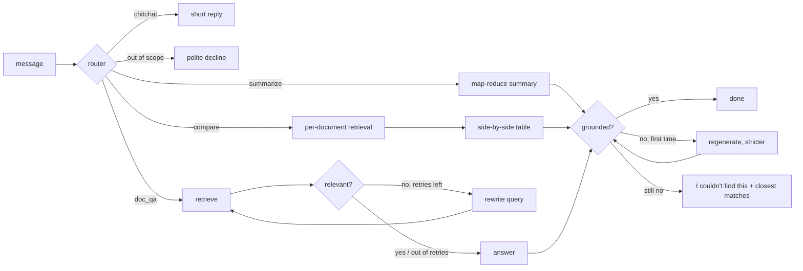

# NexusRAG

> Advanced Retrieval-Augmented Generation chatbot: hybrid search, reranking, a self-correcting agent, inline citations and a measurable evaluation suite, built on **Chainlit + ChromaDB + Google Gemini**.

[](LICENSE)
[](https://www.python.org/)

> **Status:** under active development. The live demo link, CI badge and full documentation arrive in later phases.

## What this is

NexusRAG goes beyond the naive *chunk → embed → retrieve → generate* loop. The retrieval and orchestration logic is written by hand, with no LangChain or LlamaIndex, so every step of the pipeline is visible and explainable.

Planned capabilities:

- **Structure-aware, parent–child chunking.** Small chunks are searched and full sections are sent to the LLM.
- **Hybrid retrieval.** Dense vectors (Gemini embeddings in ChromaDB) and BM25 are fused with Reciprocal Rank Fusion.
- **Cross-encoder reranking** with `BAAI/bge-reranker-base`.
- **Query transformation.** Follow-up condensation, multi-query expansion and optional HyDE.
- **Self-correcting agent.** An intent router, a relevance grader with query rewrites, and a groundedness check.
- **Grounded answers** with inline `[n]` citations that open the exact source chunk, or the PDF at the cited page.
- **A transparent chat UI** that shows every pipeline step with its timing, alongside uploads, knowledge bases, modes and persistent history.
- **Semantic cache** that reuses the answer to a near-duplicate question, cutting cost and
  latency roughly tenfold, and never outlives the documents it cites.
- **Evaluation suite** covering hit@k, MRR, context precision/recall, faithfulness, answer relevance, refusal rate, latency and cost.

## Local development

Requires Python 3.11+.

```bash
python -m venv .venv
# Windows: .venv\Scripts\activate    macOS/Linux: source .venv/bin/activate
pip install -e ".[dev]"
cp .env.example .env          # then set GEMINI_API_KEY
```

Check your Gemini key and model names with a few real, cheap API calls:

```bash
python scripts/smoke_gemini.py
```

Run the quality gates. CI runs the same commands, with Gemini mocked:

```bash
ruff check . && ruff format --check . && mypy && pytest
```

### Ingesting documents

```bash
python -m nexusrag.ingest data/                       # index the sample corpus (incremental)
python -m nexusrag.ingest report.pdf https://example.com/guide --collection research
python -m nexusrag.ingest data/ --prune               # also remove docs whose files were deleted
python -m nexusrag.ingest --list                      # what's indexed
python -m nexusrag.ingest --list-collections          # knowledge bases
```

Supported sources: **PDF** (with page numbers and tables), **DOCX**, **Markdown**, **TXT** and **web URLs**.

How documents are processed:
- **Parsing.** Loaders extract structure: headings, paragraphs, lists, tables (rendered as Markdown) and code blocks.
  - PDF: headings come from the outline or from font sizes; running headers, footers and page numbers are removed; tables and paragraphs split by a page break are re-joined.
  - URLs: fetched with SSRF protection (private and link-local addresses are refused on every redirect), and the main content is extracted with trafilatura.
- **Parent–child chunking.** Documents are split along their headings into *parent* sections of up to about 1,200 tokens, which is what the LLM reads. Each parent is cut into *child* chunks of about 256 tokens with a 40-token sentence-aligned overlap; children are what get embedded and searched.
  - Small sibling sections are merged into one parent.
  - Tables are never split mid-table.
  - Every chunk records its section path, e.g. `2 Hardware > 2.3 Battery System`.
- **Incremental indexing.**
  - Unchanged files are skipped (SHA-256 of the file).
  - Changed files replace their old chunks in Chroma, BM25 and the parent store.
  - Unchanged chunks inside a changed file reuse their existing vectors, so an edit costs only the changed chunks.
- **Storage.** Vectors live in ChromaDB (one collection per knowledge base). The document registry, parent sections and BM25 token lists share one SQLite file, so each document update commits atomically.

The `data/` folder holds a small fictional corpus about "Skylark Dynamics", a made-up drone maker, used for the demo and the evaluation suite. It contains two product specs (PDF and DOCX), an HR policy (Markdown), a support FAQ (TXT) and a quarterly report (PDF with financial tables). To regenerate the binary files, run `python scripts/build_sample_docs.py`.

### Asking questions

```bash
chainlit run app.py                                   # chat UI at http://localhost:8000
python -m nexusrag.ask "How long does the Aurora X1 battery last?" --show-context
```

Retrieval runs in stages, and each stage can be switched on or off:

| Stage | What it does | Why |
|---|---|---|
| Query condensation | Rewrites a follow-up ("and its warranty?") into a standalone question using the last few messages (fast model; skipped when there's no history) | Follow-ups can't be searched on their own |
| Multi-query (`ENABLE_MULTI_QUERY`) | Adds 3 paraphrases of the question | Different wording finds passages the original phrasing misses |
| HyDE (`ENABLE_HYDE`, off by default) | Drafts a hypothetical answer passage and searches with its embedding (dense only) | Helps when questions and documents are worded very differently |
| Hybrid search (`ENABLE_HYBRID`) | Dense search in Chroma plus BM25, top 20 each, for every query | Embeddings capture meaning; BM25 catches exact codes like "CH-400" |
| Reciprocal Rank Fusion (k=60) | Merges all rankings by rank, not score | No score normalisation needed; agreement across lists wins |
| Reranking (`ENABLE_RERANK`) | `BAAI/bge-reranker-base` rescores the top 20 fused candidates; the final order fuses its ranking with the hybrid one, keeping the top-k above `RERANK_THRESHOLD` | Reading query and passage together is far more accurate than comparing embeddings |
| Parent expansion | Swaps chunks for their parent sections, within a 6,000-token budget | Small chunks for precise search, full sections for enough context |

The cross-encoder is an optional extra because it pulls in PyTorch:

```bash
pip install -e ".[rerank]" --extra-index-url https://download.pytorch.org/whl/cpu
```

Without it, or if the model can't be loaded, reranking falls back to Gemini-as-reranker automatically. Set `RERANKER_BACKEND=gemini` to use Gemini on purpose.

### The self-correcting agent

Each message goes through a hand-written state machine (`src/nexusrag/agent/graph.py`) rather than a framework:



- **Router.** One fast-model call with a JSON schema returns the route, the target documents (for summaries and comparisons) and the standalone form of a follow-up question. Obvious greetings skip it entirely.
- **Relevance grader.** Checks whether the passages can answer the question. If not, it names what's missing and a better query, and the agent retries up to twice, merging new passages with the earlier ones. It stops early when a rewrite also finds nothing.
- **Groundedness check.** Verifies every claim against the cited passages. An unsupported answer is regenerated once with the offending claims called out. If it still fails, the agent says the documents don't support an answer and shows the closest matches.
- **Refusals never fall back on general knowledge.** They show the nearest passages instead.
- **Summaries** go in one call for small documents and use map-reduce for large ones. **Comparisons** retrieve per document, number passages globally and produce a cited table.
- **Switchable.** `ENABLE_SELF_CORRECTION=false` (or `self_correct=False` per request) turns both graders off; the evaluation uses this to measure what they add.

Each answer is grounded in the retrieved passages:
- The passages that survive reranking go to the answer model as numbered context.
- Gemini streams an answer that cites every factual sentence with `[n]`. The passages are treated as untrusted data, so instructions hidden in a document are ignored.
- Citations to passages that don't exist are removed after generation.
- Click a `[n]` marker in the UI to open the source panel: file, page, section, the matched chunk and the full section the model read.
- If the documents don't cover the question, the answer says *"I couldn't find this in your documents."* instead of falling back on general knowledge.

### Semantic cache

Many questions are near-duplicates of earlier ones ("What is the battery life of the Aurora X1?" after "How long does the Aurora X1 battery last?"). After routing, the agent embeds the router's standalone question and looks for a cached answer. On a hit it returns that answer, with its citations and source panels, and skips retrieval, grading and generation.

| | Full pipeline | Cache hit |
|---|---|---|
| Measured on the sample corpus | ~15 s, 7–10 LLM calls, ~$0.003–0.006 | ~1.5–2 s, 2 calls (router + embedding), ~$0.0004 |

An answer is reused only when **all** of these hold:

- **Same knowledge base, unchanged.** Ingesting or deleting a document bumps the knowledge base version and deletes its cached answers in the same SQLite transaction. That includes ingestion from the CLI in another process.
- **Same settings.** A fingerprint covers the route, the search scope, answer style, retrieval switches, self-correction and the models, so a concise answer is never served for a detailed request.
- **Similar enough:** cosine similarity ≥ `CACHE_SIMILARITY_THRESHOLD` (0.96).
- **Same numbers and codes.** Tokens containing a digit (Q2, 2026, X1, CH-400) must match exactly.

Why the extra guard, and why 0.96 rather than 0.95? Calibrated on `gemini-embedding-2` query embeddings, paraphrases scored 0.952–0.995, while different questions scored up to 0.938 (battery life vs charge time). "Revenue in Q2 2026" vs "Q1 2026" scored 0.947, higher than the loosest paraphrase, and no threshold separates that pair from real paraphrases, so the key-term guard does. A missed hit only costs a normal answer; a false hit would give a wrong one, so the threshold leans towards precision.

Only cited, grounded, non-refusal answers from the documents are stored. Each knowledge base keeps up to `CACHE_MAX_ENTRIES` answers, and the least recently used are evicted. The cache can be switched off per chat in the settings panel, or globally with `ENABLE_SEMANTIC_CACHE=false`. The evaluation always runs with it off.

### The chat UI

`chainlit run app.py` starts the full chat experience at http://localhost:8000:

- **Login.** Password login with `AUTH_USERNAME` / `AUTH_PASSWORD`, compared in constant time. Locally, with no password set, the configured username logs in with any password. Staging and production refuse every login until a password is set, and refuse to start without `CHAINLIT_AUTH_SECRET`.
- **History.** Chats are stored in SQLite (`storage/chainlit.db`) and can be resumed from the sidebar after a restart. The follow-up context is rebuilt from the saved messages. Thumbs up/down feedback on each answer is saved too.
- **Uploads.** Drag PDF, DOCX, Markdown or TXT files into the chat, up to `MAX_UPLOAD_FILES` per message and `MAX_UPLOAD_MB` each. Each file gets a progress line (parsing, embedding N chunks, then indexed with section and chunk counts). The **Add a web page** button or the `/url` command indexes a URL.
- **Settings panel.** Pick or create a knowledge base, restrict search to chosen documents, set top-k, switch hybrid search, multi-query, HyDE, reranking and self-correction on or off, and choose a concise or detailed answer style.
- **Modes.** The chat profiles *Q&A*, *Summarize* and *Compare* force the agent's route. Each mode shows starter questions for the documents you have.
- **Transparent pipeline.** Every agent node appears as a timed step under one *Pipeline* entry. The steps show the route and standalone question, the search queries, the hybrid candidates (dense, BM25 and RRF ranks), the reranked passages, the grader verdicts and any regeneration.
- **Citations.** `[n]` opens the cited section in a side panel, with the matched excerpt highlighted. For PDFs, a *PDF page N* link opens the original file at the cited page (a copy is kept in `storage/files/`).
- **Follow-ups.** After a grounded answer, 2-3 suggested questions appear as buttons (`ENABLE_FOLLOW_UPS`).
- **`/stats`.** Shows documents, sections, chunks and vectors for the current knowledge base, plus the semantic cache's hit rate and model usage and estimated cost since start. `/clear-cache` forgets the knowledge base's cached answers.
- **Limits.** Messages (`RATE_LIMIT_MESSAGES_PER_MINUTE`) and uploads (`RATE_LIMIT_UPLOADS_PER_HOUR`) are rate-limited per user. Logs never contain questions, answers, document text or secrets.
- **No cold start.** The cross-encoder loads in the background when the app starts, so the first question doesn't wait for it.

Resumed chats keep their text and sources list but not the side panels. Chainlit only persists elements when a blob storage provider (S3, GCS or Azure) is configured.

### Models

All model IDs are configured via environment variables (see [.env.example](.env.example)):

| Role | Default | Used for |
|------|---------|----------|
| `GENERATION_MODEL` | `gemini-3.8-flash` | User-facing answers (streamed) |
| `FAST_MODEL` | `gemini-3.5-flash-lite` | Query rewriting, routing, grading |
| `EMBEDDING_MODEL` | `gemini-embedding-2` (768-d) | Chunk and query embeddings |

**Resilience.** Each call retries transient failures (429, 5xx and timeouts) up to 3 times with jittered backoff capped at 8 s. If the model is still overloaded, or returns "model not found", the call switches to `GENERATION_FALLBACK_MODEL` (`gemini-3.6-flash`) or `FAST_FALLBACK_MODEL` (`gemini-3.1-flash-lite`). An answer interrupted mid-stream is cleared and regenerated once on the fallback model. Embeddings never fall back, because another model's vectors wouldn't match the index.

`gemini-embedding-2` has no `task_type` parameter. Queries are embedded as `task: search result | query: …` and documents as `title: … | text: …`, following Google's guidance for asymmetric retrieval. Temperature is left at the Gemini 3 default unless you set it explicitly.

## Branching model

| Branch      | Purpose                                                        |
|-------------|----------------------------------------------------------------|
| `main`      | Production. Only updated by a reviewed PR from `staging`.       |
| `staging`   | Default integration branch; deploys to the staging environment. |
| `feat/*`    | Feature work, branched from `staging` and merged back via PR.   |

## License

[MIT](LICENSE)
