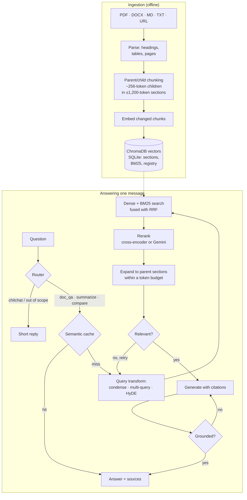
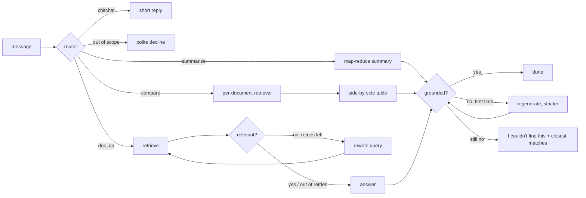

# NexusRAG

> Advanced Retrieval-Augmented Generation chatbot: hybrid search, reranking, a self-correcting agent, inline citations and a measurable evaluation suite, built on **Chainlit + ChromaDB + Google Gemini**.

[](https://github.com/Neel-Khandelwal-03/nexusrag/actions/workflows/ci.yml)
[](LICENSE)
[](https://www.python.org/)

**Live demo:** _deployed in the next phase; the link lands here._

## What this is

NexusRAG answers questions about your own documents and shows its work: every factual
sentence cites the passage it came from, and when the documents don't cover a question it
says so instead of guessing.

It goes beyond the naive *chunk → embed → retrieve → generate* loop, and the retrieval and
orchestration logic is written by hand, with no LangChain or LlamaIndex, so every step is
visible, testable and explainable.



### How each feature improves on naive RAG

| Naive RAG | NexusRAG | Why it matters |
|---|---|---|
| Fixed-size chunks | Structure-aware parent/child chunks | Small chunks are searched; the whole section is read, so answers don't stop mid-table |
| Dense search only | Dense + BM25 fused with RRF | Embeddings catch meaning, BM25 catches codes like `CH-400`; [the evaluation](#evaluation) shows where each wins |
| Top-k by vector distance | Cross-encoder (or Gemini) reranking, fused with the first-stage order | Reading query and passage together beats comparing embeddings, and fusion stops one noisy score burying a good hit |
| Question used verbatim | Follow-up condensation, multi-query, optional HyDE | "And its warranty?" becomes a searchable question; different phrasings find different passages |
| One-shot retrieve → answer | Router, relevance grader with retries, groundedness check | Bad retrieval is caught and retried; unsupported answers are regenerated or declined |
| Bare answer text | Inline `[n]` citations, source panels, PDF at the cited page | Every claim is checkable in one click |
| Cache by exact string | Semantic cache with a version and settings fingerprint | Reuses answers to rephrased questions, and never outlives the documents it cites |
| "Looks good to me" | Evaluation suite over a reviewed question set | Retrieval and answer quality are measured, not asserted |

### Screenshots

<!-- Replace these with real captures of the running app (drag the images into a GitHub
     issue comment to host them, then paste the URLs here). -->

| | |
|---|---|
| _Chat with citations and the pipeline steps_ | _Source panel with the matched passage_ |
| _Upload progress and knowledge bases_ | _`/stats` and the settings panel_ |

## Local development

Requires Python 3.11+.

```bash
python -m venv .venv
# Windows: .venv\Scripts\activate    macOS/Linux: source .venv/bin/activate
pip install -e ".[dev]"
cp .env.example .env          # then set GEMINI_API_KEY
```

Check your Gemini key and model names with a few real, cheap API calls:

```bash
python scripts/smoke_gemini.py
```

Run the quality gates. CI runs the same commands, with Gemini mocked:

```bash
ruff check . && ruff format --check . && mypy && pytest
```

### Running with Docker

```bash
cp .env.example .env          # set GEMINI_API_KEY (and AUTH_PASSWORD if you want a login)
docker compose up --build     # http://localhost:8000
```

The image is slim, runs as a non-root user and keeps the index, chat history and model
cache in a named volume, so they survive rebuilds. On first start the container indexes
`data/` if the knowledge base is empty (`BOOTSTRAP_INDEX=false` turns that off).

It ships with the **Gemini reranker**: the local cross-encoder needs torch and
sentence-transformers (hundreds of megabytes) and about 8 s per query on 2 vCPUs, and the
evaluation found it didn't improve answers on this corpus. To include it anyway:

```bash
docker build --build-arg INSTALL_RERANK=true -t nexusrag:rerank .
docker run --rm -p 8000:8000 --env-file .env -e RERANKER_BACKEND=cross_encoder \
  -v nexusrag-data:/data nexusrag:rerank
```

Without Compose:

```bash
docker build -t nexusrag .
docker run --rm -p 8000:8000 --env-file .env -v nexusrag-data:/data nexusrag
```

| Path / variable | Purpose |
|---|---|
| `/data` (volume) | `STORAGE_DIR=/data/storage` (Chroma, SQLite, kept PDFs) and `HF_HOME=/data/models` |
| `PORT` | Port Chainlit listens on (default 8000) |
| `BOOTSTRAP_INDEX` | Index `data/` on start when the knowledge base is empty |
| `scripts/healthcheck.py` | Used by the image's `HEALTHCHECK` and by Compose |

### Ingesting documents

```bash
python -m nexusrag.ingest data/                       # index the sample corpus (incremental)
python -m nexusrag.ingest report.pdf https://example.com/guide --collection research
python -m nexusrag.ingest data/ --prune               # also remove docs whose files were deleted
python -m nexusrag.ingest --list                      # what's indexed
python -m nexusrag.ingest --list-collections          # knowledge bases
```

Supported sources: **PDF** (with page numbers and tables), **DOCX**, **Markdown**, **TXT** and **web URLs**.

How documents are processed:
- **Parsing.** Loaders extract structure: headings, paragraphs, lists, tables (rendered as Markdown) and code blocks.
  - PDF: headings come from the outline or from font sizes; running headers, footers and page numbers are removed; tables and paragraphs split by a page break are re-joined.
  - URLs: fetched with SSRF protection (private and link-local addresses are refused on every redirect), and the main content is extracted with trafilatura.
- **Parent–child chunking.** Documents are split along their headings into *parent* sections of up to about 1,200 tokens, which is what the LLM reads. Each parent is cut into *child* chunks of about 256 tokens with a 40-token sentence-aligned overlap; children are what get embedded and searched.
  - Small sibling sections are merged into one parent.
  - Tables are never split mid-table.
  - Every chunk records its section path, e.g. `2 Hardware > 2.3 Battery System`.
- **Incremental indexing.**
  - Unchanged files are skipped (SHA-256 of the file).
  - Changed files replace their old chunks in Chroma, BM25 and the parent store.
  - Unchanged chunks inside a changed file reuse their existing vectors, so an edit costs only the changed chunks.
- **Storage.** Vectors live in ChromaDB (one collection per knowledge base). The document registry, parent sections and BM25 token lists share one SQLite file, so each document update commits atomically.

The `data/` folder holds a small fictional corpus about "Skylark Dynamics", a made-up drone maker, used for the demo and the evaluation suite. It contains two product specs (PDF and DOCX), an HR policy (Markdown), a support FAQ (TXT) and a quarterly report (PDF with financial tables). To regenerate the binary files, run `python scripts/build_sample_docs.py`.

### Asking questions

```bash
chainlit run app.py                                   # chat UI at http://localhost:8000
python -m nexusrag.ask "How long does the Aurora X1 battery last?" --show-context
```

Retrieval runs in stages, and each stage can be switched on or off:

| Stage | What it does | Why |
|---|---|---|
| Query condensation | Rewrites a follow-up ("and its warranty?") into a standalone question using the last few messages (fast model; skipped when there's no history) | Follow-ups can't be searched on their own |
| Multi-query (`ENABLE_MULTI_QUERY`) | Adds 3 paraphrases of the question | Different wording finds passages the original phrasing misses |
| HyDE (`ENABLE_HYDE`, off by default) | Drafts a hypothetical answer passage and searches with its embedding (dense only) | Helps when questions and documents are worded very differently |
| Hybrid search (`ENABLE_HYBRID`) | Dense search in Chroma plus BM25, top 20 each, for every query | Embeddings capture meaning; BM25 catches exact codes like "CH-400" |
| Reciprocal Rank Fusion (k=60) | Merges all rankings by rank, not score | No score normalisation needed; agreement across lists wins |
| Reranking (`ENABLE_RERANK`) | `BAAI/bge-reranker-base` rescores the top 20 fused candidates; the final order fuses its ranking with the hybrid one, keeping the top-k above `RERANK_THRESHOLD` | Reading query and passage together is far more accurate than comparing embeddings |
| Parent expansion | Swaps chunks for their parent sections, within a 6,000-token budget | Small chunks for precise search, full sections for enough context |

The cross-encoder is an optional extra because it pulls in PyTorch:

```bash
pip install -e ".[rerank]" --extra-index-url https://download.pytorch.org/whl/cpu
```

Without it, or if the model can't be loaded, reranking falls back to Gemini-as-reranker automatically. Set `RERANKER_BACKEND=gemini` to use Gemini on purpose.

### The self-correcting agent

Each message goes through a hand-written state machine (`src/nexusrag/agent/graph.py`) rather than a framework:



- **Router.** One fast-model call with a JSON schema returns the route, the target documents (for summaries and comparisons) and the standalone form of a follow-up question. Obvious greetings skip it entirely.
- **Relevance grader.** Checks whether the passages can answer the question. If not, it names what's missing and a better query, and the agent retries up to twice, merging new passages with the earlier ones. It stops early when a rewrite also finds nothing.
- **Groundedness check.** Verifies every claim against the cited passages. An unsupported answer is regenerated once with the offending claims called out. If it still fails, the agent says the documents don't support an answer and shows the closest matches.
- **Refusals never fall back on general knowledge.** They show the nearest passages instead.
- **Summaries** go in one call for small documents and use map-reduce for large ones. **Comparisons** retrieve per document, number passages globally and produce a cited table.
- **Switchable.** `ENABLE_SELF_CORRECTION=false` (or `self_correct=False` per request) turns both graders off; the evaluation uses this to measure what they add.

Each answer is grounded in the retrieved passages:
- The passages that survive reranking go to the answer model as numbered context.
- Gemini streams an answer that cites every factual sentence with `[n]`. The passages are treated as untrusted data, so instructions hidden in a document are ignored.
- Citations to passages that don't exist are removed after generation.
- Click a `[n]` marker in the UI to open the source panel: file, page, section, the matched chunk and the full section the model read.
- If the documents don't cover the question, the answer says *"I couldn't find this in your documents."* instead of falling back on general knowledge.

### Semantic cache

Many questions are near-duplicates of earlier ones ("What is the battery life of the Aurora X1?" after "How long does the Aurora X1 battery last?"). After routing, the agent embeds the router's standalone question and looks for a cached answer. On a hit it returns that answer, with its citations and source panels, and skips retrieval, grading and generation.

| | Full pipeline | Cache hit |
|---|---|---|
| Measured on the sample corpus | ~15 s, 7–10 LLM calls, ~$0.003–0.006 | ~1.5–2 s, 2 calls (router + embedding), ~$0.0004 |

An answer is reused only when **all** of these hold:

- **Same knowledge base, unchanged.** Ingesting or deleting a document bumps the knowledge base version and deletes its cached answers in the same SQLite transaction. That includes ingestion from the CLI in another process.
- **Same settings.** A fingerprint covers the route, the search scope, answer style, retrieval switches, self-correction and the models, so a concise answer is never served for a detailed request.
- **Similar enough:** cosine similarity ≥ `CACHE_SIMILARITY_THRESHOLD` (0.96).
- **Same numbers and codes.** Tokens containing a digit (Q2, 2026, X1, CH-400) must match exactly.

Why the extra guard, and why 0.96 rather than 0.95? Calibrated on `gemini-embedding-2` query embeddings, paraphrases scored 0.952–0.995, while different questions scored up to 0.938 (battery life vs charge time). "Revenue in Q2 2026" vs "Q1 2026" scored 0.947, higher than the loosest paraphrase, and no threshold separates that pair from real paraphrases, so the key-term guard does. A missed hit only costs a normal answer; a false hit would give a wrong one, so the threshold leans towards precision.

Only cited, grounded, non-refusal answers from the documents are stored. Each knowledge base keeps up to `CACHE_MAX_ENTRIES` answers, and the least recently used are evicted. The cache can be switched off per chat in the settings panel, or globally with `ENABLE_SEMANTIC_CACHE=false`. The evaluation always runs with it off.

### The chat UI

`chainlit run app.py` starts the full chat experience at http://localhost:8000:

- **Login.** Password login with `AUTH_USERNAME` / `AUTH_PASSWORD`, compared in constant time. Locally, with no password set, the configured username logs in with any password. Staging and production refuse every login until a password is set, and refuse to start without `CHAINLIT_AUTH_SECRET`.
- **History.** Chats are stored in SQLite (`storage/chainlit.db`) and can be resumed from the sidebar after a restart. The follow-up context is rebuilt from the saved messages. Thumbs up/down feedback on each answer is saved too.
- **Uploads.** Drag PDF, DOCX, Markdown or TXT files into the chat, up to `MAX_UPLOAD_FILES` per message and `MAX_UPLOAD_MB` each. Each file gets a progress line (parsing, embedding N chunks, then indexed with section and chunk counts). The **Add a web page** button or the `/url` command indexes a URL.
- **Settings panel.** Pick or create a knowledge base, restrict search to chosen documents, set top-k, switch hybrid search, multi-query, HyDE, reranking and self-correction on or off, and choose a concise or detailed answer style.
- **Modes.** The chat profiles *Q&A*, *Summarize* and *Compare* force the agent's route. Each mode shows starter questions for the documents you have.
- **Transparent pipeline.** Every agent node appears as a timed step under one *Pipeline* entry. The steps show the route and standalone question, the search queries, the hybrid candidates (dense, BM25 and RRF ranks), the reranked passages, the grader verdicts and any regeneration.
- **Citations.** `[n]` opens the cited section in a side panel, with the matched excerpt highlighted. For PDFs, a *PDF page N* link opens the original file at the cited page (a copy is kept in `storage/files/`).
- **Follow-ups.** After a grounded answer, 2-3 suggested questions appear as buttons (`ENABLE_FOLLOW_UPS`).
- **`/stats`.** Shows documents, sections, chunks and vectors for the current knowledge base, plus the semantic cache's hit rate and model usage and estimated cost since start. `/clear-cache` forgets the knowledge base's cached answers.
- **Limits.** Messages (`RATE_LIMIT_MESSAGES_PER_MINUTE`) and uploads (`RATE_LIMIT_UPLOADS_PER_HOUR`) are rate-limited per user. Logs never contain questions, answers, document text or secrets.
- **No cold start.** The cross-encoder loads in the background when the app starts, so the first question doesn't wait for it.

Resumed chats keep their text and sources list but not the side panels. Chainlit only persists elements when a blob storage provider (S3, GCS or Azure) is configured.

### Models

All model IDs are configured via environment variables (see [.env.example](.env.example)):

| Role | Default | Used for |
|------|---------|----------|
| `GENERATION_MODEL` | `gemini-3.8-flash` | User-facing answers (streamed) |
| `FAST_MODEL` | `gemini-3.5-flash-lite` | Query rewriting, routing, grading |
| `EMBEDDING_MODEL` | `gemini-embedding-2` (768-d) | Chunk and query embeddings |

**Resilience.** Each call retries transient failures (429, 5xx and timeouts) up to 3 times with jittered backoff capped at 8 s. If the model is still overloaded, or returns "model not found", the call switches to `GENERATION_FALLBACK_MODEL` (`gemini-3.6-flash`) or `FAST_FALLBACK_MODEL` (`gemini-3.1-flash-lite`). An answer interrupted mid-stream is cleared and regenerated once on the fallback model. Embeddings never fall back, because another model's vectors wouldn't match the index.

`gemini-embedding-2` has no `task_type` parameter. Queries are embedded as `task: search result | query: …` and documents as `title: … | text: …`, following Google's guidance for asymmetric retrieval. Temperature is left at the Gemini 3 default unless you set it explicitly.

## Evaluation

Everything above is measurable, so `eval/` measures it: a reviewed question set, metrics
written by hand, and a runner that scores several pipeline configurations over the same
questions.

```bash
python -m nexusrag.ingest data/ --collection eval     # the corpus the questions come from
python -m eval.run_eval --collection eval             # the four configurations below
python -m eval.run_eval --configs dense,full --limit 10   # a quick subset
```

Each run writes `eval/reports/<run>/`: `summary.md` (the tables below), `summary.csv`,
`results.csv` (one row per question and configuration) and `results.jsonl`. Results are
checkpointed as they arrive, so a run stopped by rate limits resumes with `--resume <run>`
without paying for finished questions again.

### The questions

`eval/dataset.jsonl` holds 61 reviewed questions over the five sample documents: 53
answerable and 8 the documents don't cover. Each answerable item records the reference
answer, exact evidence quotes and the source sections and chunks they come from.

`python -m eval.generate_dataset` drafts questions from sampled sections with Gemini,
checks every quote against the text and verifies the unanswerable ones (retrieval plus the
relevance grader must agree the documents can't answer them). Everything is then reviewed
by hand.

Those generated questions turned out to be too easy: they echo the wording of the section
they were written from, and every configuration scored ~100%. So the set also contains 19
hand-written questions in the phrasing real users actually type:

| Type | Example | What it stresses |
|---|---|---|
| paraphrase (10) | "How long can the Borealis stay in the air on one battery?" | Everyday words; the document says "maximum flight time" |
| identifier (6) | "What is the TH-640?", "What do I use PeopleHub for?" | Product codes and system names, where BM25 should shine |
| keyword (3) | "Q2 gross margin", "battery storage temperature" | Bare search-box queries |

### Metrics

Retrieval is scored on the sections handed to the answer model. Faithfulness, context
precision and context recall, and answer relevance use an LLM judge (one call each).

| Metric | Meaning |
|---|---|
| Hit@k / MRR | A source section is in the top k; 1 / rank of the first one |
| Context precision / recall | Judged relevance of the passages (rank-weighted); share of the reference answer's statements the passages support |
| Faithfulness | Share of the answer's claims the passages support (refusals have no claims to check) |
| Answer relevance | 1-5 rating of how directly the answer addresses the question, scaled to 0-1 |
| Correct / false refusals | Unanswerable questions declined; answerable questions wrongly declined |
| Latency, cost | Per query, excluding questions slowed by free-tier rate limiting, and counting only the system's own model calls |

### Results

61 questions, k = 5, all models `gemini-3.5-flash-lite` (the free tier's daily quota rules
out the larger Flash models for a run of this size), semantic cache off.

| Configuration | Hit@5 | MRR | Context precision | Context recall | Faithfulness | Answer relevance | Correct refusals | False refusals | Latency p50 / p95 | Cost / query |
|---|---|---|---|---|---|---|---|---|---|---|
| Dense only (baseline) | 100% | 0.93 | 90% | 100% | 100% | 100% | 100% | 0% | 3.2 s / 7.5 s | $0.0009 |
| Hybrid (dense + BM25 + RRF) | 92% | 0.85 | 83% | 92% | 100% | 92% | 100% | 8% | 4.0 s / 14.9 s | $0.0010 |
| Hybrid + reranking | 91% | 0.87 | 86% | 91% | 100% | 91% | 100% | 9% | 12.2 s / 18.7 s | $0.0009 |
| **Full** (hybrid + reranking + query rewriting + self-correction) | **100%** | 0.91 | 89% | 100% | 100% | 96% | 100% | 4% | 16.1 s / 47.3 s | $0.0018 |

Hit rate by question type tells the real story:

| Configuration | paraphrase (10) | identifier (6) | keyword (3) | numeric (18) | table (6) | comparison (4) | fact (6) | answered an unanswerable (8) |
|---|---|---|---|---|---|---|---|---|
| Dense only | 100% | 100% | 100% | 100% | 100% | 100% | 100% | 0% |
| Hybrid | 60% | 100% | 100% | 100% | 100% | 100% | 100% | 0% |
| Hybrid + reranking | 50% | 100% | 100% | 100% | 100% | 100% | 100% | 0% |
| Full | 100% | 100% | 100% | 100% | 100% | 100% | 100% | 0% |

**What this corpus shows, honestly:**

- **On five short documents, dense search alone already finds every answer.** BM25 and
  reranking cannot improve on that, and both *lose* paraphrased questions: "How long can
  the Borealis stay in the air?" matches sections containing "battery" while the
  flight-time table, which never uses that word, drops out of the top 5. That is the cost
  of keyword matching on a small corpus, and it is why the comparison is worth running
  rather than assuming.
- **Query rewriting and self-correction repair exactly that damage:** the full pipeline is
  back to 100% on paraphrases and 100% overall, at roughly 4x the latency and twice the
  cost of the baseline. Multi-query searches wording the document might use, and the
  relevance grader retries when the first attempt comes back thin.
- **No configuration ever answered an unanswerable question**, and faithfulness is 100%
  throughout: when the context doesn't support an answer, the pipeline says so.
- **Expect the balance to shift with scale.** BM25 earns its place on larger, more
  repetitive corpora and on exact codes; here the identifier questions were easy for every
  configuration because there is only one document to confuse them with.

The two remaining failures (both paraphrases) are the answer model refusing although the
right section was retrieved, which is a model-quality limit of flash-lite rather than a
retrieval one.

**A bug the evaluation found.** In the first complete run, hybrid + reranking scored 87%
Hit@5 with **15% false refusals**. The cross-encoder's score threshold was dropping *every*
passage on some questions, so the agent refused with nothing to read and the answer model
never saw the evidence. Reranking now keeps at least `RERANK_MIN_KEEP` (3) passages in the
fused order, leaving the "not in your documents" decision to the answer model and the
graders:

| Configuration | Hit@5 before → after | False refusals before → after |
|---|---|---|
| Hybrid + reranking | 87% → 91% | 15% → 9% |
| Full | 96% → 100% | 8% → 4% |

## Deployment

Both environments run the same image; only secrets and the Space differ.

| Environment | Branch | Space |
|---|---|---|
| Staging | `staging` | `nexusrag-staging` |
| Production | `main` | `nexusrag` |

**Hugging Face Spaces (primary).** Create a Docker Space, then in *Settings → Variables and
secrets* add `GEMINI_API_KEY`, `AUTH_PASSWORD` and `CHAINLIT_AUTH_SECRET`
(`chainlit create-secret`) as secrets, and `ENVIRONMENT`, `PORT=7860` and
`STORAGE_DIR=/data/storage` as variables. Attach persistent storage so the index and chat
history survive restarts. GitHub Actions pushes the repository to the Space on every merge
into `staging` (staging) or `main` (production), and the Space rebuilds the image itself.

**Google Cloud Run (alternative).** Build and push the image to Artifact Registry, then
deploy with `--port 8000`, at least 2 GiB of memory and the same environment variables,
with secrets from Secret Manager. Cloud Run's filesystem is ephemeral, so mount a
persistent volume (Cloud Storage FUSE or Filestore) at `/data`, or accept that the index
is rebuilt from `data/` on each cold start.

In both cases the free Gemini tier allows only 20 requests a day per Flash model, which a
public demo exhausts quickly; enable billing or point `GENERATION_MODEL` at a
flash-lite model.

## Design decisions and trade-offs

- **No LangChain or LlamaIndex.** The whole pipeline is a few hundred lines of explicit
  code: RRF, the agent state machine and the cache are all readable in one sitting, and
  every stage is unit-tested with a fake Gemini. A framework would hide exactly the parts
  this project is meant to show, and its abstractions tend to fight custom control flow.
- **Parent/child chunking (≈256-token children inside ≤1,200-token sections).** Small
  chunks make search precise; large ones make answers complete. Splitting the two lets
  each do its job. The sizes come from the corpus: 256 tokens is about a paragraph, and
  1,200 keeps a whole section (with its table) inside the context budget.
- **Hybrid search, with an honest caveat.** BM25 earns its place on exact codes and rare
  terms, but on this five-document corpus it *hurt* paraphrased questions, and the
  evaluation says so plainly rather than assuming every technique helps.
- **Reranking fused with the first-stage order, and a floor.** Pure reranking once buried
  a table that both retrievers ranked first, so the two rankings are fused. A score
  threshold trims the tail, but at least three passages always survive: an empty context
  turns answerable questions into refusals.
- **SQLite for everything except vectors.** The registry, sections, BM25 index and cache
  share one file, so a document can be replaced (and its cached answers dropped) in a
  single transaction. Chroma holds only the vectors.
- **The agent is a hand-written state machine.** Each node returns the next node, so the
  control flow sits in one readable place and every step can be shown in the UI with its
  timing.
- **Safety by default.** Answers cite passages or decline; graders fail open so a grader
  outage can't block answers; logs never contain document text, questions or secrets.

## Known limitations and future work

- **Text only.** Images and diagrams in PDFs are ignored, and scanned documents need OCR
  first. Multimodal retrieval (image and table embeddings) is the obvious next step.
- **One machine, one process.** Chroma and SQLite are local files; horizontal scaling
  would need a hosted vector store and Postgres.
- **No entity or relationship graph.** Questions spanning many documents ("which products
  share a supplier?") would benefit from GraphRAG-style structure.
- **The cache is shared by everyone using an instance.** That suits a single-tenant demo;
  multi-tenant use needs per-user scoping.
- **Evaluation runs on a small corpus** (5 documents, 61 questions) with flash-lite as the
  judge. Bigger corpora and a stronger judge would sharpen the conclusions.
- **Reranking on CPU is slow** (~8 s per query on 2 vCPUs), which is why the Docker image
  defaults to the Gemini reranker.

## Branching model

| Branch      | Purpose                                                        |
|-------------|----------------------------------------------------------------|
| `main`      | Production. Only updated by a reviewed PR from `staging`.       |
| `staging`   | Default integration branch; deploys to the staging environment. |
| `feat/*`    | Feature work, branched from `staging` and merged back via PR.   |

## License

[MIT](LICENSE)
